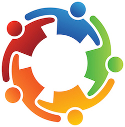

## Introduction

Group Work is an important concept that is often applied in the real world. People helping each other not only increases the efficiency of work but can also help people learn how to interact with people they don’t know well and make good relationships with others. I always thought I was doing okay at this part; however, I am truly wrong.

## Self-Reflection & Backgournd

Looking back at all my group work experience in college, I realized I’ve been used to the kind of group work where people separate the tasks, each person does their own part, and then we just combine everything at the end. We still talk to each other and update our progress, but that format didn’t help me see the real meaning behind group work.

Group work isn’t just about working with others. It also means that every group member shares the responsibility. What one person does represents what we all have done. This is the part I haven’t learned well.

Back in 10th grade, I transferred to a school where everyone made it very clear which part they did and which part they didn’t. I noticed this from the first day — maybe it was the school’s teaching style, but every student separated their own work from others’. This made me feel stressed all the time, and it started to affect me. I began focusing more on what I had done, and not so much on the group as a whole.

## Experience from ICS 414

That influence stayed with me, and it’s been bad for me. I started to care only about my own part. I didn’t notice this problem until I took this class. I still remember the professor telling me twice: he’s not saying I did something wrong, he’s saying our group did something wrong. But in my head, I always separated what I did from what my group members did. So every time we got feedback, I still reacted like I was not the one doing the wrong thing. Even though it might not be super obvious, I think this affected my relationship with my group members. I don’t know what they think, but maybe it seemed like I only cared about myself instead of the whole team.

I’ve tried to change, but it’s not as easy as I thought. When the professor first told me, I already realized I had this problem. But the second time it happened, I still couldn’t control it — I said, “This part wasn’t done by me,” without even thinking. I felt regret right after saying it, but it was already too late.

Besides that, I also realized I can be kind of stubborn about the things I’ve done. During the group work, I found out that one of our group members was working on the same part I had been doing since the beginning of the semester. When I noticed this, I should’ve just let that person continue and gone to help other group members instead. But because of my stubbornness, I felt like I had already spent a lot of time on it, and I didn’t want to give it up so easily. So I started thinking — maybe I could modify my part and make it more advanced.

I did finish that advanced version, but based on the reaction from the professor and our customer, it seemed like they didn’t care about the advanced features. What they really wanted was a complete and working website from the whole group. After presenting my concept, I didn’t upload the code for my advanced part to GitHub because I started to realize it wasn’t what they were asking for. I did try to change — I asked my group members if anyone needed help — but no one replied to me. In the end, I got a bad grade for the project.

Honestly, I think that’s the result I deserve. My attitude was a big problem. I tried to fix things at the end, but it was already too late.

## Conclusion

All of these issues led to the worst group work experience I’ve had in college. Still, even though it was a bad experience, I’m actually thankful for it. I was able to discover this problem in myself before graduating. I did learn some technical things, like coding and building a financial website, but to be honest, the biggest lesson I got from this class was about group work and receiving honest feedback. I need to be more careful about my attitude toward group work. I need to change, and in the future, I want to really work as part of a team — not just as an individual.
