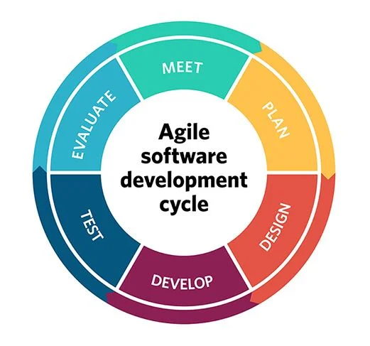

## What are User Interface Frameworks?

According to “What is UI Frameworks and Reason to Use UI Frameworks,” the user interface framework is a collection of libraries, pre-built components, and design elements that can be reused in the process of creating the user interface.

## User Interface Frameworks are important!

User interface frameworks are an important concept in software engineering since it is an important part of web application development. Developers will use user interface frameworks to help them create a web page for users to use. Therefore, whether a developer can create a good and powerful web page depends on the user interface frameworks they use. There are many types of user interface frameworks for developers to use. To successfully create a good web page, every developer should know what type of user interface frameworks they need to use for the project or at least know which one they are more familiar with.

## Personal experience with User Interface Frameworks

During the process of developing the web application for my final project, I found out that I like to use React as my user interface framework. I was more familiar with React compared to other user interface frameworks. The components and design elements it has are also useful for me in my web application development. When I face difficulties, the guild lines in the React website help me a lot.

## Conclusion

Overall, I got to solve the challenges I faced during the development of my final web application because I chose the user interface framework that was suitable for me. I think for software engineering, it is important that developers understand what project they are working on, what outcome they should come up with, and what types of tools they are more familiar with. If they understand, they should be able to be successful.

## What is agile project management?

According to Gillis (n.d.), agile project management (APM) is a way to help the software development group work collaboratively and quickly. The idea behind this management is that it will divide the work into small sections and work in small batches, visualize processes, and collaborate with end users to get feedback (Gillis, n.d.). The process above can help the group reply, discuss, and come up with solutions or make new changes when facing challenges, and then achieve the goal and become successful.

## What is issue-driven project management?

Issue-driven project management is a kind of agile project management for a small group of people (around a dozen). It focuses on separating the work into small tasks and assigning each task to one group member. Every task (issue) should write down the requirements of the outcome so that the group members will have a better understanding of what to do. Issue-driven project management requires group members to meet twice every week. During the meeting time, all the members can report their progress, discuss the current challenges, and come up with possible solutions to solve the challenge.

## Personal experience in Issue-driven project management

Our group follows Issue-driven project management to finish our final project. We listed all the tasks (issues) that going to do and then assigned one to each person. Using this management, We can know which person is doing which part, and then interact with another group member when our tasks are related or connected. The meetings twice a week can give us (every group member) a chance to update what we (they) have at that time or share the challenges and difficulties they faced. The sharing can let us (all the group members) discuss together and find possible solutions or change the original plan when things don’t work out.

## Apply to different projects in the future

Issue-driven project management can be applied to different project contexts. The key idea behind issue-driven project management is not just software engineering but also how to make a group work efficiently and be able to overcome every challenge when facing difficulty. The advantages of good planning, organizing, and flexibility could make me see myself applying issue-driven project management to different project contexts.

<a href="https://www.sencha.com/blog/what-is-ui-frameworks-and-reason-to-use-ui-frameworks/">Reference1</a>
<a href="https://www.techtarget.com/searchcio/definition/Agile-project-management">Reference2</a>
