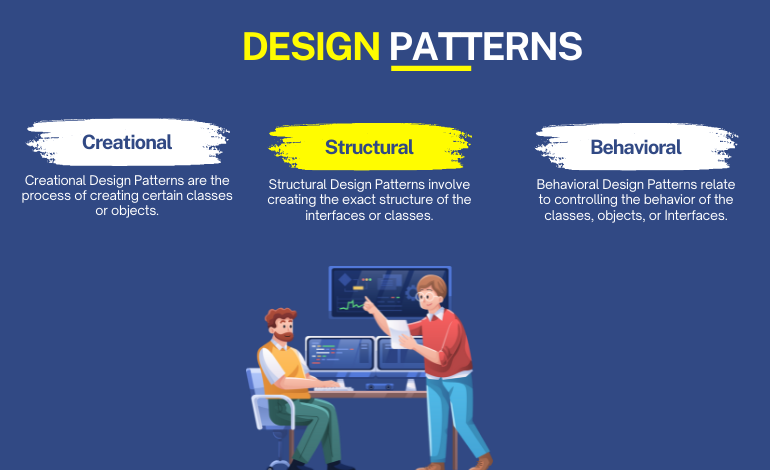

## The basic thing you should know about design patterns

According to Rahman (2019), Design patterns are design-level solutions for recurring problems. It is not code, rather it is a description of how to solve the issues or problems and design solutions under different kinds of situations. Design patterns can be separated into three types with a total of 23 classic patterns. Those three types of design patterns are creational patterns, structural patterns, and behavioral patterns. Creational patterns are patterns that are related to the class instantiation, structural patterns are patterns that are related to the class’s structure and composition, and then behavioral patterns are patterns that are related to how a class communicates with others (Rahman, 2019). To choose the right pattern to use, we need to understand both the problem and the patterns we have. Understanding what the problem is about, and what kind of pattern can help solve the problem efficiently is the key point to help people succeed.

## What are your favorite or most often used design patterns?

Although I have mentioned above that people should understand the problem first to choose the right design pattern. There are still some design patterns that stand out from the other patterns, often being used, and becoming people’s favorite. In my personal experience, I think I have experience using the composite pattern which is a kind of structural pattern. A composite pattern is like a tree graph that has many different levels, and those levels are connected. Other design patterns that people often use are the singleton pattern, the builder pattern, the facade pattern, the proxy pattern, the template method pattern, and so on.

## Conclusion

There are still a lot of patterns that aren’t mentioned in this article for readers to discover. When people get deep into those design patterns, they can find out that those patterns are very interesting, and can benefit people a lot.

[Resource 1](https://www.freecodecamp.org/news/the-basic-design-patterns-all-developers-need-to-know/)
[Resource 2](https://newsletter.techworld-with-milan.com/p/how-to-select-a-design-pattern)
