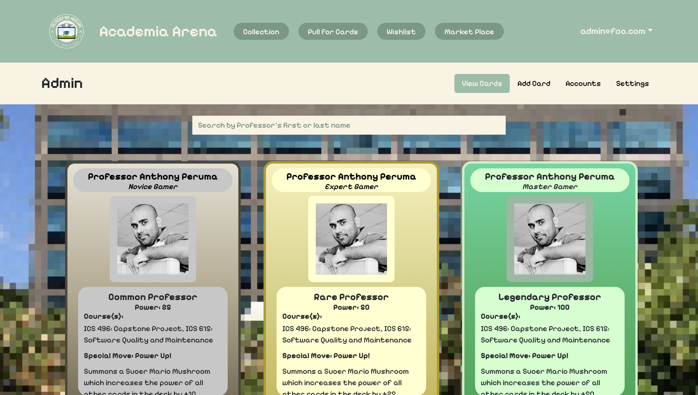
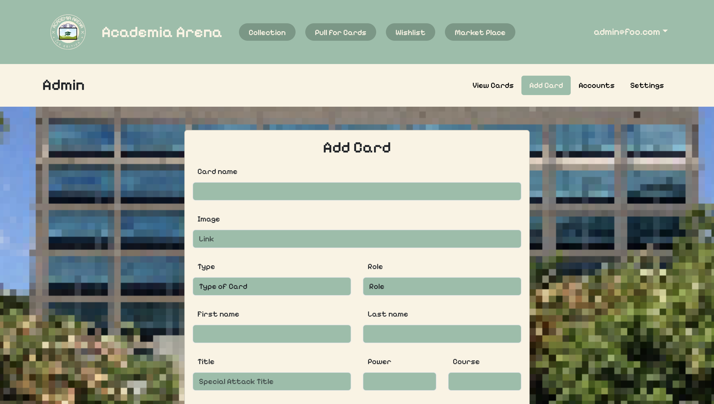
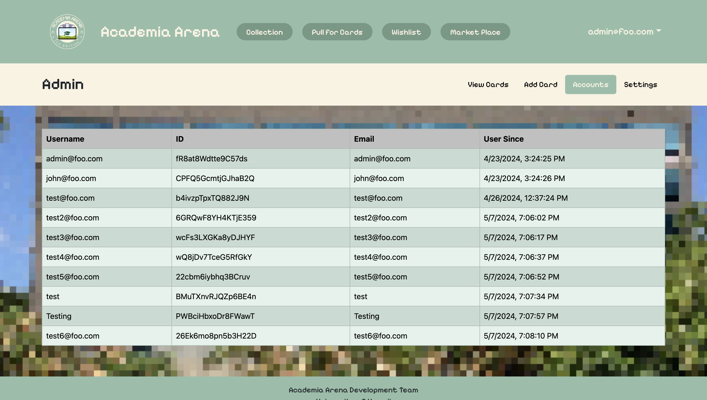
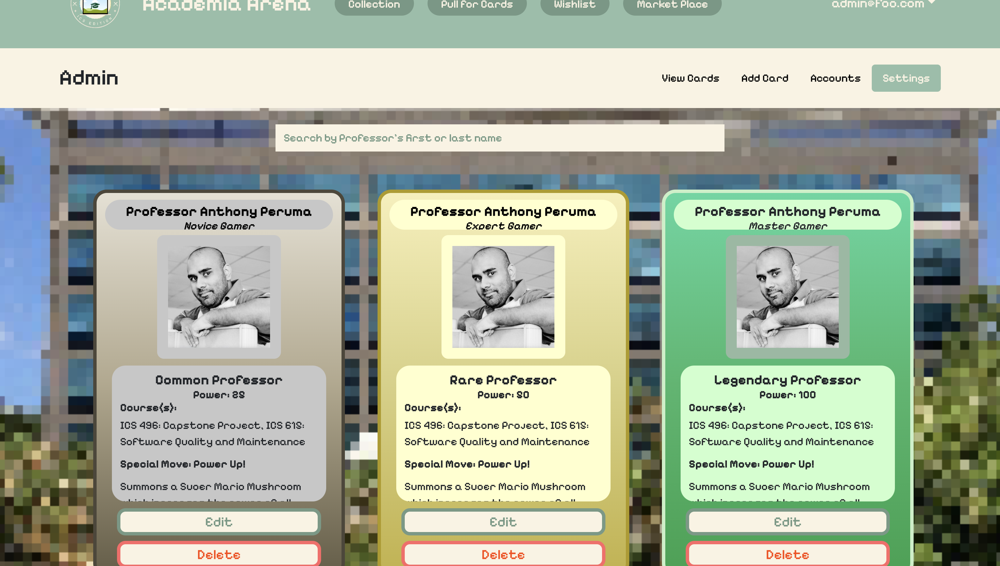

Academia Arena: ICS Edition is a web application that I and my team members created in ICS 314. The purpose of this web application is to help connect ICS students with their professors. In this web application, users will answer questions related to computer science and get a chance to pull a card after they get a score of 100%. The card they get will include information about the professor, students can know more about the professor by looking at the information on the card. One specific feature of our application is that users can trade their cards with other users if they wish to.

My contributions to this project are mainly related to the admin database part. I created the view cards page, add card page, account page, and settings page in admin. The view cards page lists all the cards we have for this application. The add card page allows us to add a new card to the application. The account page lets us know how many users sign up for our application. The settings page is for us to edit and delete cards.

Because of this project, I learned lots of knowledge on creating the web application and experience working in a group to create a web application. The process of developing the application helped me know more about what [Meteor](http://meteor.com) can do and have good experience with how to use [React Bootstrap](https://react-bootstrap.netlify.app/), CSS, [MongoDB](http://mongodb.com), and Javascript for our application. The experience of doing the project helped me know more about how to manage the process of creating the web application and interact with my group members. The style of management we used is called Issue Driven Project Management which divides the work into many different tasks and then assigns each task to one team member. We will report to our group members when we make good progress or face challenges. 

Overall, I gained lots of variable knowledge and experiences by doing this project.

<a href="https://academia-arena.github.io/">Academia Arena: ICS Edition</a>

