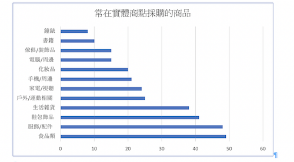

When I was living in Taiwan, my school required students to do a project called personal projects. This personal project is only for 10th-grade students, and at the beginning of the semester, the teachers introduced all the rules for the projects and gave students a year to finish the project.

The topic of my project was online shopping vs in-store shopping. I did some research about these two ways of shopping, analyzed their advantages and disadvantages, and made a questionnaire asking people several questions about whether they prefer online shopping or in-store shopping.

This is the first big project I have done in my life, and because of this experience, I got to learn how to manage my time wisely, design questionnaires to ask people questions and write an essay based on my research and analysis.

Part of the results I got from the questionnaires:

